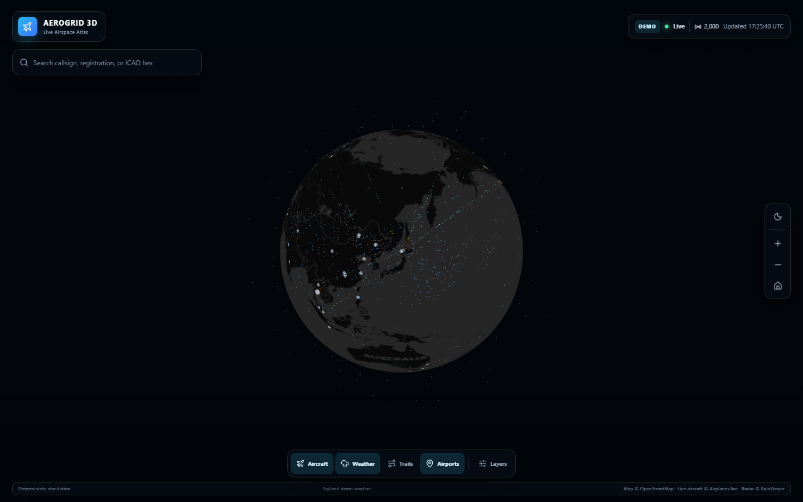

# AeroGrid 3D

An aviation-first live 3D atlas: aircraft are the subject, weather is the context.

AeroGrid has two intentionally separate experiences:

- **Global Demo** — a deterministic worldwide simulation for fluid exploration. It never calls a live aircraft endpoint.
- **Live Beta** — real aircraft within an on-demand radius of 1–250 NM. If live data fails, AeroGrid shows a clear unavailable state instead of inserting demo aircraft.

The public beta is designed for non-commercial, low-cost operation without an SLA. Accounts, alerts, history playback, infrastructure layers, and live satellites are outside v1.



## Product behavior

- Compact desktop toolbar and details panel; mobile dock and scrollable bottom sheets.
- Regional aircraft search, selection, tracking, altitude, speed, heading, vertical rate, and last reception age.
- English by default with complete Japanese UI translation.
- Live source, coverage, update time, freshness, and failure state are always visible.
- The last successful aircraft snapshot may be shown as `STALE` for at most five minutes. It is then removed.
- Desktop Demo renders up to 2,000 aircraft; Mobile Demo renders up to 800.
- The Space Preview is intentionally inactive until a persistent, policy-compliant satellite cache is delivered after v1.

## Architecture

One Node service exposes the same-origin REST API and serves the Vite production bundle. There is no browser-to-provider access, WebSocket, SQLite, Redis, or Gemini configuration.

```text
Browser -> Node /api/v1 -> 60 s shared aircraft cache -> Airplanes.live
                    \-> 10 min weather cache --------> RainViewer
        -> Node static files -> Vite bundle
```

Public endpoints:

- `GET /api/v1/status`
- `GET /api/v1/flights?lat={-90..90}&lon={-180..180}&radius_nm={1..250}`
- `GET /api/v1/weather`

Shared types live in `shared/contracts.ts`, including `AppMode`, `SourceStatus`, and `DataSnapshot<T>`.

## Data sources and limits

| Data | Source | Runtime policy |
| --- | --- | --- |
| Live aircraft | [Airplanes.live API](https://airplanes.live/api-guide/) and [tiers](https://airplanes.live/api/) | Server-only, 250 NM maximum, 60-second cache, 1 upstream request/second, 450-request daily soft limit, stop upstream retries after HTTP 429 |
| Radar | [RainViewer API](https://www.rainviewer.com/api.html) | Server-only metadata, latest documented PNG frame, 10-minute cache, one metadata refresh after tile failure |
| Demo | AeroGrid deterministic generator | Never presented as live data |

[OpenSky](https://opensky-network.org/about/terms-of-use) is not enabled in the public product. Live satellite data is also disabled until it can use a persistent cache and comply with the [CelesTrak usage policy](https://www.celestrak.org/usage-policy.php).

Provider availability and terms can change. Review the linked terms before every public release. Attribution is displayed in the application.

## Local development

Requires Node.js 22 and npm.

```bash
npm ci
npm run dev
```

Open `http://localhost:3000`. The Vite server proxies `/api` to the Node API on port `4000`. Copy `.env.example` only if you need a different local API port.

## Verification

```bash
npm run lint       # TypeScript
npm test           # unit and API integration tests
npm run test:e2e   # Playwright at 1440x900 and 390x844
npm run build      # client + compiled production server
npm audit
```

`npm run check` runs TypeScript, Vitest, and the full production build. Pull requests run all of the checks above in GitHub Actions, including Playwright.

Release history is maintained in [CHANGELOG.md](CHANGELOG.md). Please report suspected vulnerabilities privately as described in [SECURITY.md](SECURITY.md).

## Production

Build and run the compiled same-origin service:

```bash
npm ci
npm run build
PORT=8080 npm start
```

The multi-stage `Dockerfile` runs as the unprivileged `node` user and health-checks `/api/v1/status`.

`cloudbuild.yaml` publishes to Artifact Registry and deploys Cloud Run in `asia-northeast1` with scale-to-zero and one maximum instance. Before using it:

1. Create the Artifact Registry repository (default substitution: `aerogrid`).
2. Confirm Cloud Build can push images and deploy Cloud Run.
3. Override `_REPOSITORY` or `_SERVICE` if needed.
4. Review provider terms, daily request metrics, structured JSON logs, and the degraded source state after deployment.

## License

[MIT](LICENSE). Third-party data remains subject to each provider's terms and attribution requirements.
